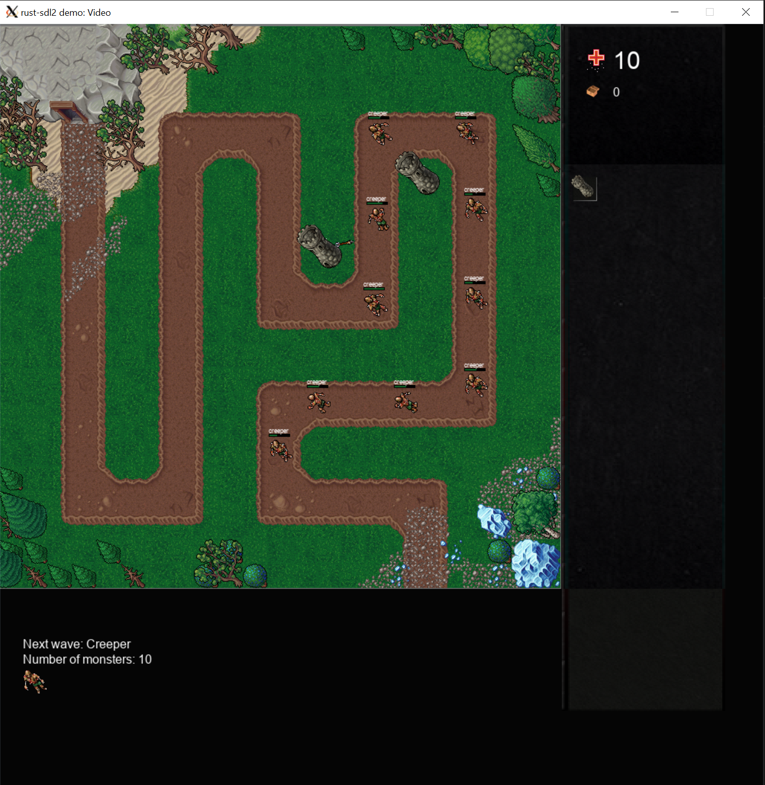
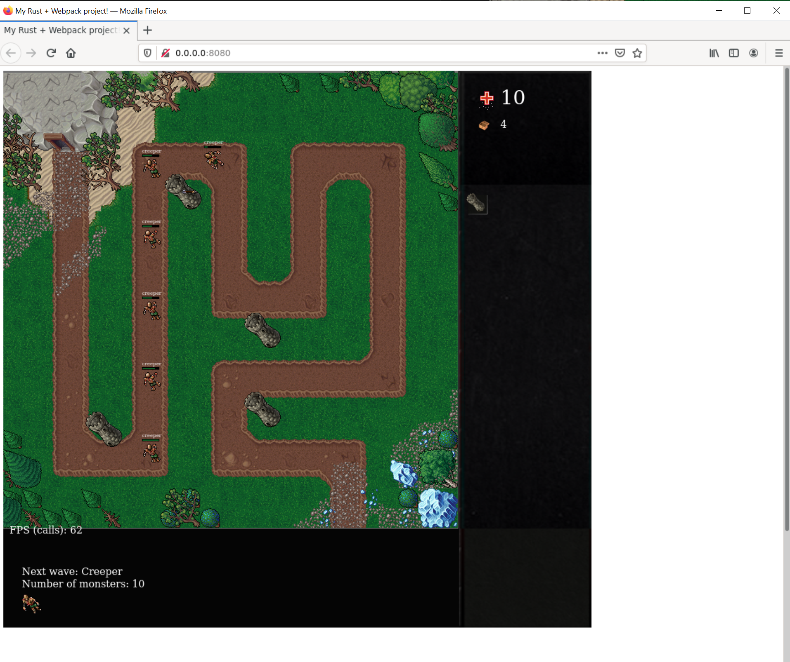

# Tower Defense RUST

Works both in-browser (thanks to WASM) and as desktop version (OpenGL). The project was built when I was on my notice period waiting for my next job to learn Rust. ( :

## Desktop

Desktop version can be tested on Windows with Windows-Subsystem-For-Linux and XLaunch (Disable native OpenGL).

### Start

```
cd rust
cargo build
./target/debug/desktop
```



## Web version

### Start

```
wasm-pack build rust/wasm
cd rust/wasm
yarn start
```


